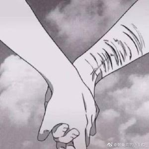
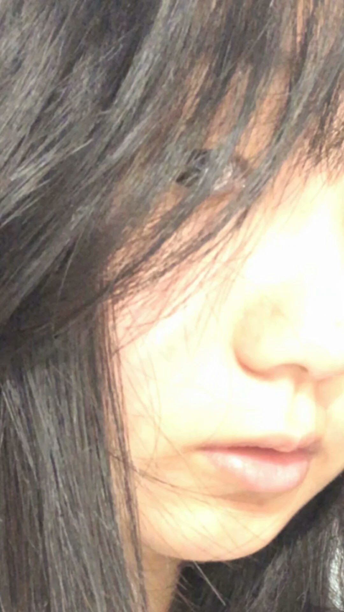
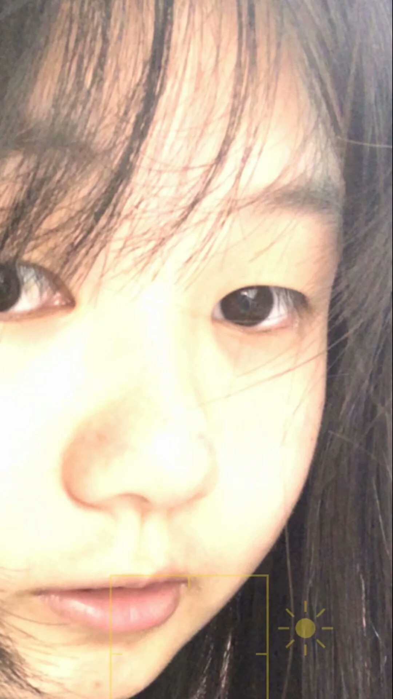
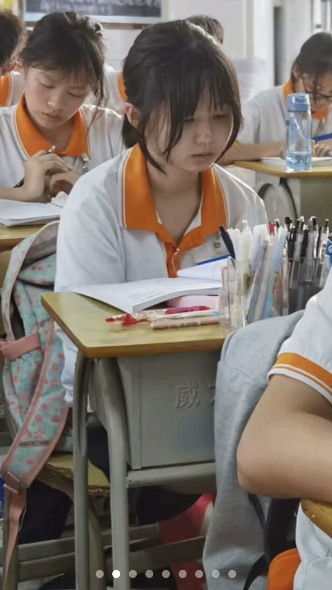

<!--
 * @Author: whalefall
 * @Date: 2021-06-17 15:29:59
 * @LastEditTime: 2021-06-17 16:11:08
 * @Description: 抑郁症自述
-->

# Why build this repository?
> ## I can see her whenever I'm writing code, even though she doesn't like me anymore. (我是老添狗 in Chinese Speaking)
> 
> ## The coding that makes me happier.
# MyCuteGirl
## MyCuteGirl ! She's 14 years old in China.
# My story
## I was diagnosed with depression in my second year of junior high school.
## After that, I wasn't interested in anything..
## And than,I've been thinking all day about how to kill myself.
## My parents took me to a mental hospital to see a doctor, the doctor gave me a lot of medicine.
> 比如说: 碳酸锂,西酞普兰,阿米替林, **舍曲林没吃了副作用有点大**

 
> 
> 现在也没去上学了,很难过.....
> 
> 好像 `重度抑郁症` 转 `双向情感障碍` 了
## I began to become lazy and numb.
## I know I'm a waste of money living in this world...
# But it wasn't until I met her.....
> ## She's cute, and I love to pinch her face, and she's happy to do it
## She made me feel a little happy.
## But it won't cure my depression either.
## She was disappointed in me.
## 现在已经没去上学了,很快就要中考了,我也不知道怎么办了.每次抑郁发作都想跳楼.
# This is her.

